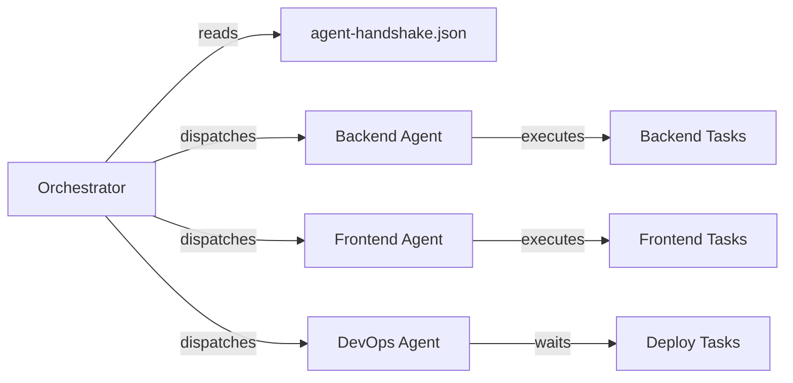

# Agent Handshake Protocol

## Overview

The Agent Handshake protocol enables AI coding assistants, automation agents, and orchestration systems to understand the development environment capabilities after setup. The `agent-handshake.json` file serves as a machine-readable interface describing what tools are available and what tasks can be performed.

## Purpose

Modern development workflows increasingly involve AI agents and automation. These agents need to:

1. **Discover capabilities**: What languages, tools, and frameworks are available?
2. **Assess readiness**: Can they execute specific tasks (build, test, deploy)?
3. **Route tasks**: Which specialized agent should handle each task?
4. **Verify environment**: Is the setup complete and correct?

## Handshake File (`agent-handshake.json`)

### Structure

```json
{
  "protocol_version": "1.0",
  "setup_status": "success",
  "setup_id": "20260102-120000-a1b2c3",
  "timestamp": "2026-01-02T12:00:00Z",
  "environment": {
    "os": "linux",
    "arch": "x86_64",
    "shell": "bash"
  },
  "toolchains": [
    {
      "name": "node",
      "version": "20.11.0",
      "path": "/home/user/.nvm/versions/node/v20.11.0/bin/node",
      "available": true
    },
    {
      "name": "python",
      "version": "3.12.1",
      "path": "/home/user/miniconda3/bin/python",
      "available": true
    },
    {
      "name": "rust",
      "version": "1.75.0",
      "path": "/home/user/.cargo/bin/rustc",
      "available": true
    }
  ],
  "roles": [
    {
      "name": "backend",
      "agent": "backend-agent",
      "tools": ["python", "rust", "postgres"],
      "ready": true,
      "missing": []
    },
    {
      "name": "frontend",
      "agent": "frontend-agent",
      "tools": ["node", "typescript"],
      "ready": true,
      "missing": []
    },
    {
      "name": "devops",
      "agent": "devops-agent",
      "tools": ["docker", "kubectl"],
      "ready": false,
      "missing": ["kubectl"]
    }
  ],
  "recommended_tasks": [
    {
      "task": "backend-init",
      "command": "uvx cookiecutter python-project",
      "agent": "backend-agent",
      "enabled": true
    },
    {
      "task": "frontend-scaffold",
      "command": "pnpm create vite",
      "agent": "frontend-agent",
      "enabled": true
    }
  ],
  "capabilities": {
    "can_build_backend": true,
    "can_build_frontend": true,
    "can_deploy": false,
    "can_test": true
  }
}
```

### Field Descriptions

#### Root Fields

- **protocol_version**: Version of the handshake protocol (currently "1.0")
- **setup_status**: "success" or "partial" or "failed"
- **setup_id**: Links to the setup run that created this environment
- **timestamp**: When the handshake file was generated

#### Environment

Describes the host system:

- **os**: Operating system (linux, darwin, windows)
- **arch**: CPU architecture (x86_64, arm64, etc.)
- **shell**: Default shell (bash, zsh, powershell)

#### Toolchains

Array of installed development tools:

- **name**: Tool identifier (node, python, rust, go, etc.)
- **version**: Exact version installed
- **path**: Full path to the tool executable
- **available**: Boolean indicating if tool is accessible

#### Roles

Defines logical roles and which agents can fulfill them:

- **name**: Role identifier (backend, frontend, devops, ai, etc.)
- **agent**: Which agent should handle this role
- **tools**: Required tools for this role
- **ready**: Boolean indicating if all required tools are available
- **missing**: Array of tools that are missing (if any)

#### Recommended Tasks

Suggests initial tasks that can be performed:

- **task**: Task identifier
- **command**: Executable command to run
- **agent**: Which agent should execute this task
- **enabled**: Boolean indicating if this task is currently viable

#### Capabilities

High-level capability flags:

- **can_build_backend**: Can compile/build backend code
- **can_build_frontend**: Can compile/build frontend code
- **can_deploy**: Can deploy to production
- **can_test**: Can run test suites

## Agent Integration Patterns

### Discovery Pattern

Agents read the handshake file to understand environment:

```python
import json

with open('agent-handshake.json') as f:
    handshake = json.load(f)

if handshake['setup_status'] == 'success':
    # Environment is ready
    toolchains = {t['name']: t for t in handshake['toolchains']}

    if 'python' in toolchains and toolchains['python']['available']:
        # Can execute Python tasks
        python_version = toolchains['python']['version']
        python_path = toolchains['python']['path']
```

### Role-Based Routing

Orchestrators can route tasks to specialized agents:

```javascript
const handshake = require('./agent-handshake.json');

function routeTask(taskType) {
  const role = handshake.roles.find(r => r.name === taskType);

  if (role && role.ready) {
    return role.agent; // e.g., "backend-agent"
  } else if (role) {
    throw new Error(`Role ${taskType} not ready. Missing: ${role.missing.join(', ')}`);
  } else {
    throw new Error(`Unknown role: ${taskType}`);
  }
}

// Route task to appropriate agent
const agent = routeTask('backend');
console.log(`Routing to: ${agent}`);
```

### Capability Checking

Before executing tasks, verify capabilities:

```bash
#!/bin/bash

if ! jq -e '.capabilities.can_build_backend' agent-handshake.json | grep -q true; then
  echo "❌ Backend build not available"
  exit 1
fi

# Proceed with backend build
echo "✅ Backend build capability verified"
```

## Multi-Agent Orchestration

### Example: Task Dispatch

```yaml
# Example orchestration config
tasks:
  - name: init-backend
    if: .roles[] | select(.name=="backend").ready
    agent: backend-agent
    command: uvx cookiecutter python-project

  - name: init-frontend
    if: .roles[] | select(.name=="frontend").ready
    agent: frontend-agent
    command: pnpm create vite

  - name: setup-ci
    if: .capabilities.can_deploy
    agent: devops-agent
    command: ./scripts/setup-ci.sh
```

### Example: Parallel Execution

Agents can work in parallel on independent tasks:



## Protocol Versioning

The protocol uses semantic versioning:

- **1.0**: Initial release
- **1.1**: (Future) Add resource constraints (memory, CPU)
- **2.0**: (Future) Breaking changes to schema

Agents should check `protocol_version` and handle accordingly:

```python
version = handshake['protocol_version']
major, minor = map(int, version.split('.'))

if major != 1:
    raise ValueError(f"Unsupported protocol version: {version}")
```

## Best Practices

1. **Always Check Status**: Verify `setup_status == "success"` before proceeding
2. **Validate Capabilities**: Don't assume; check capability flags
3. **Handle Missing Tools**: Gracefully handle cases where tools are unavailable
4. **Link to Setup ID**: Use `setup_id` to correlate with provenance and logs
5. **Update on Changes**: Regenerate handshake if environment changes

## CI/CD Integration

In CI environments, the handshake enables:

1. **Environment Validation**: Verify required tools before job execution
2. **Dynamic Job Selection**: Run only jobs for which tools are available
3. **Agent Allocation**: Assign tasks to appropriate agent pools
4. **Failure Diagnostics**: Understand why certain tasks can't run

## Example: GitHub Actions Integration

```yaml
name: Dynamic Build

on: [push]

jobs:
  check-environment:
    runs-on: ubuntu-latest
    outputs:
      can-build-backend: ${{ steps.handshake.outputs.backend }}
      can-build-frontend: ${{ steps.handshake.outputs.frontend }}
    steps:
      - uses: actions/checkout@v4
      - name: Read handshake
        id: handshake
        run: |
          echo "backend=$(jq -r '.capabilities.can_build_backend' agent-handshake.json)" >> $GITHUB_OUTPUT
          echo "frontend=$(jq -r '.capabilities.can_build_frontend' agent-handshake.json)" >> $GITHUB_OUTPUT

  build-backend:
    needs: check-environment
    if: needs.check-environment.outputs.can-build-backend == 'true'
    runs-on: ubuntu-latest
    steps:
      - name: Build backend
        run: echo "Building backend..."

  build-frontend:
    needs: check-environment
    if: needs.check-environment.outputs.can-build-frontend == 'true'
    runs-on: ubuntu-latest
    steps:
      - name: Build frontend
        run: echo "Building frontend..."
```

## Future Enhancements

- **Resource Constraints**: Memory, CPU, disk space available
- **Network Capabilities**: Internet access, VPN status
- **Security Context**: Permissions, credential availability
- **Dependency Graph**: Tool dependencies and version constraints
- **Health Checks**: Ongoing validation endpoints
- **Agent Registration**: Dynamic agent discovery and registration
