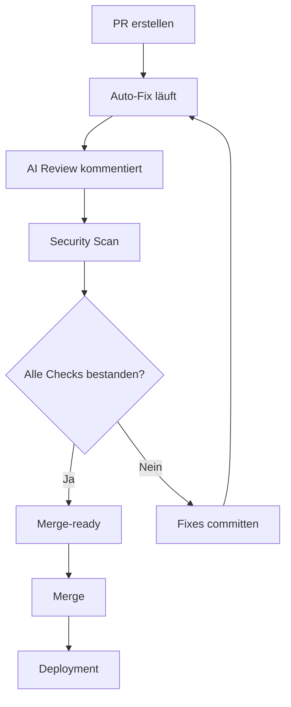

# 🤖 Automatisierung & AI-Integration

Dieses Repository ist vollständig automatisiert und nutzt AI-gestützte Tools für Code-Review, Fixes und Dependency-Management.

## 🎯 Features

### ✅ Automatische Code-Fixes

- **Auto-Format**: Prettier, Black, ESLint, Ruff
- **Auto-Lint**: Automatische Behebung von Linting-Problemen
- **Line-Endings**: Normalisierung von CRLF → LF

**Trigger:** Bei jedem Pull Request oder durch `/fix` Kommentar

### 🔍 AI Code Review

- **GitHub Copilot**: Integrierte Code-Vorschläge
- **CodeRabbit**: Detaillierte AI-Reviews ([Install](https://github.com/apps/coderabbitai))
- **CodiumAI**: Automatische Test-Generierung ([Install](https://github.com/apps/codiumai-pr-agent))

**Trigger:** Bei jedem Pull Request oder durch `/review` Kommentar

### 📦 Dependency Updates

- **Dependabot**: Wöchentliche automatische Updates (Mo 03:00 UTC)
- **Auto-Merge**: Patch/Minor Updates werden automatisch gemerged
- **Security Alerts**: Sofortige Benachrichtigung bei Vulnerabilities

### 🔒 Security Scanning

- **Gitleaks**: Secret-Detection in jedem PR
- **Dependency Review**: Überprüfung auf bekannte CVEs
- **Security Audit**: npm/pip Sicherheits-Checks

## 🚀 Verwendung

### Pull Request erstellen

```bash
git checkout -b feature/meine-aenderung
git add .
git commit -m "feat: Neue Funktion"
git push origin feature/meine-aenderung
```

Nach dem Push:

1. ✅ **Auto-Fix** läuft automatisch
2. 🤖 **AI Review** kommentiert Verbesserungen
3. 🔍 **Security Scan** prüft auf Secrets
4. ✨ **Code Quality** analysiert den Code

### Manuelle Triggers

#### Auto-Fix erzwingen

Kommentar im PR:

```
/fix
```

#### AI-Review anfordern

Kommentar im PR:

```
/review
```

#### Validation ausführen

Kommentar im PR:

```
/validate
```

## 📋 Workflow-Übersicht

| Workflow | Trigger | Beschreibung |
|----------|---------|--------------|
| `auto-fix-pr.yml` | PR öffnen/aktualisieren, `/fix` | Automatische Code-Formatierung |
| `ai-auto-review.yml` | PR öffnen, `/review` | AI-gestütztes Code-Review |
| `auto-dependency-updates.yml` | Täglich 02:00 UTC | Dependency-Updates |
| `ai-review.yml` | PR öffnen | CodeRabbit & CodiumAI Integration |
| `code-quality.yml` | Push/PR | Codacy & Codecov Analyse |
| `security-scan.yml` | PR öffnen | Gitleaks & Dependency-Review |

## 🔧 Konfiguration

### GitHub Apps installieren (Optional, aber empfohlen)

1. **CodeRabbit** - Detaillierte AI-Reviews
   - [Install](https://github.com/apps/coderabbitai)
   - Kommentiert automatisch bei jedem PR

2. **CodiumAI PR-Agent** - Test-Generierung
   - [Install](https://github.com/apps/codiumai-pr-agent)
   - Generiert automatisch Unit-Tests

3. **Dependabot** - Ist standardmäßig aktiviert
   - Keine Installation nötig
   - Konfiguriert in `.github/dependabot.yml`

### Secrets konfigurieren

Falls nicht vorhanden, füge folgende Secrets hinzu:

```bash
# Optional für erweiterte Features
CODACY_PROJECT_TOKEN  # Für Codacy-Integration
CODECOV_TOKEN         # Für Code-Coverage-Reports
```

## 💡 Best Practices

### Commit Messages

Verwende [Conventional Commits](https://www.conventionalcommits.org/):

```
feat: Neue Funktion hinzugefügt
fix: Bug behoben
docs: Dokumentation aktualisiert
style: Code-Formatierung
refactor: Code-Umstrukturierung
test: Tests hinzugefügt
chore: Wartungsarbeiten
```

### Pre-Commit Hooks

Aktiviere lokale Pre-Commit Hooks:

```bash
# Einmalig
pip install pre-commit
pre-commit install

# Bei jedem Commit werden automatisch ausgeführt:
# - Formatierung (Prettier/Black)
# - Linting (ESLint/Ruff)
# - Secret-Scanning (Gitleaks)
```

### Branching-Strategie

```
main           ← Production-ready
  ├─ develop   ← Development
  │   ├─ feature/* ← Neue Features
  │   ├─ fix/*     ← Bugfixes
  │   └─ chore/*   ← Maintenance
  └─ hotfix/*  ← Dringende Fixes
```

## 🎨 Customization

### Auto-Fix anpassen

Editiere [`.github/workflows/auto-fix-pr.yml`](.github/workflows/auto-fix-pr.yml):

```yaml
# Füge weitere Formatter hinzu
- name: Auto-format Rust
  run: |
    cargo fmt --all
```

### AI-Review erweitern

Editiere [`.github/workflows/ai-auto-review.yml`](.github/workflows/ai-auto-review.yml):

```yaml
# Füge custom AI-Checks hinzu
- name: Custom AI Check
  run: |
    # Dein Custom-Script
```

## 🔄 Automatischer Workflow



## 📊 Status-Badges

Füge diese Badges zur README hinzu:

```markdown


```

## 🆘 Troubleshooting

### Auto-Fix läuft nicht

1. Prüfe Workflow-Permissions in Settings → Actions
2. Stelle sicher, dass `GITHUB_TOKEN` Schreibrechte hat

### AI-Review fehlt

1. Installiere CodeRabbit/CodiumAI Apps
2. Prüfe, ob Workflow-Datei existiert

### Dependabot-PRs werden nicht erstellt

1. Prüfe `.github/dependabot.yml` Syntax
2. Aktiviere Dependabot in Settings → Security

## 📚 Weitere Ressourcen

- [GitHub Actions Docs](https://docs.github.com/en/actions)
- [Dependabot Docs](https://docs.github.com/en/code-security/dependabot)
- [CodeRabbit Docs](https://docs.coderabbit.ai/)
- [Conventional Commits](https://www.conventionalcommits.org/)

---

🤖 **Vollständig automatisiert** - Lehne dich zurück und lass die Bots arbeiten!
